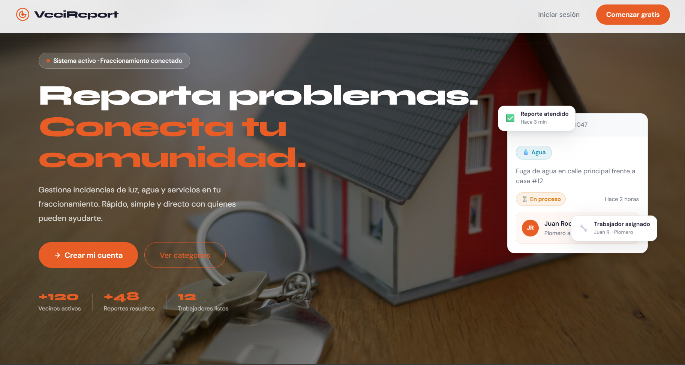
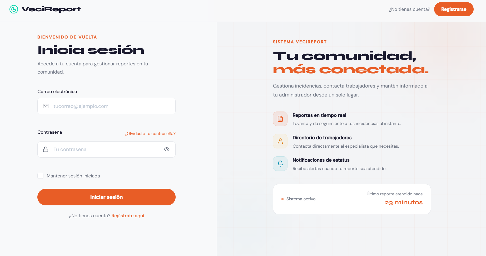
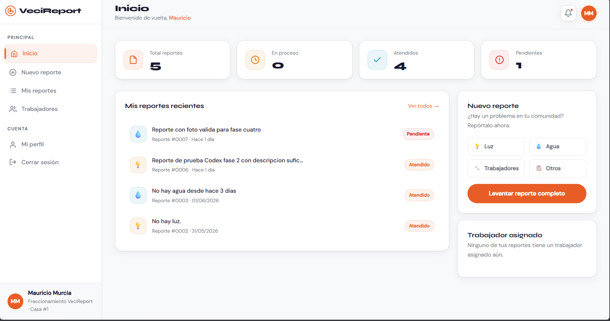
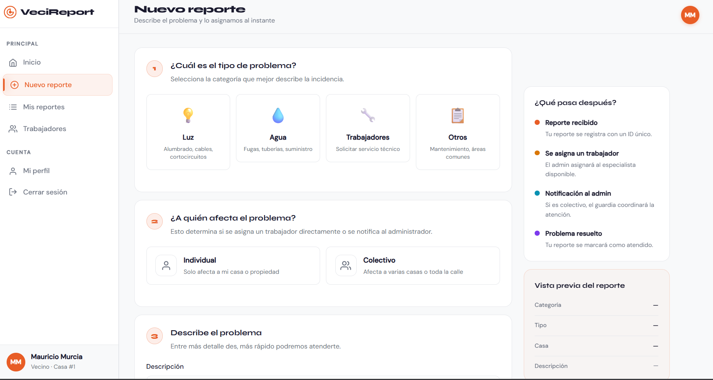
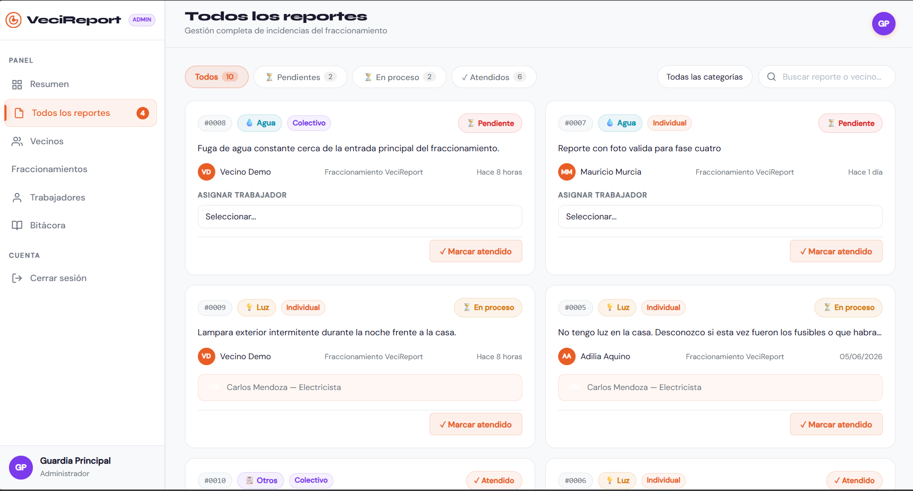
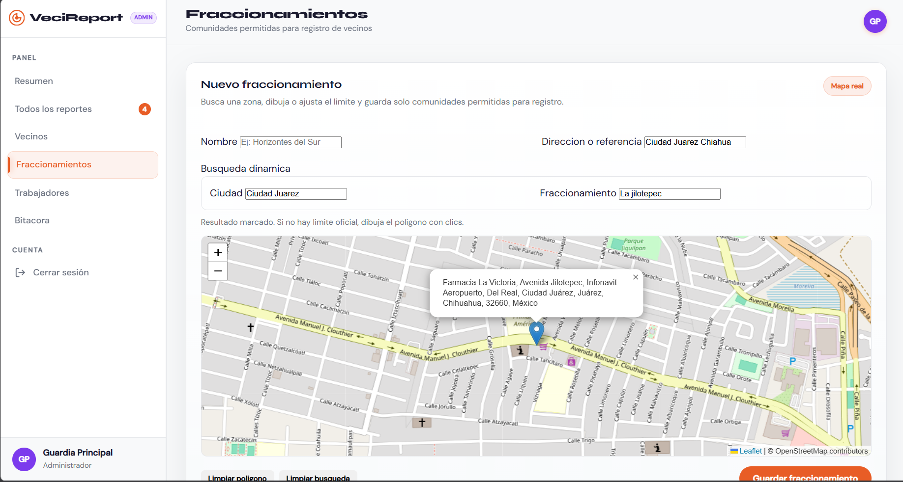

# VeciReport

Sistema web para reportar, administrar y dar seguimiento a incidencias dentro de un fraccionamiento.

VeciReport permite que los vecinos registren problemas de luz, agua, mantenimiento u otros servicios; el administrador puede aprobar vecinos, asignar trabajadores, atender reportes, gestionar el directorio y revisar la bitacora del sistema.

Proyecto desarrollado como aplicacion web academica y preparado como proyecto de portafolio para LinkedIn/GitHub.

---

## Vista General

VeciReport resuelve un flujo comun en comunidades privadas o fraccionamientos:

1. Un vecino se registra con datos de domicilio y comprobante.
2. El administrador aprueba o bloquea vecinos.
3. El vecino crea reportes con descripcion, categoria, ubicacion y foto opcional.
4. El administrador asigna trabajadores disponibles.
5. El reporte cambia de estado hasta quedar atendido.
6. El sistema registra acciones importantes en bitacora.

---

## Estado Del Proyecto

El proyecto ya esta conectado a PHP, sesiones y MySQL. Fue probado localmente con Apache de XAMPP y MySQL en el puerto `3306`.

Estado actual:

- Pantallas principales convertidas a PHP.
- HTML duplicados eliminados.
- Login funcional con roles.
- Sesiones protegidas por rol.
- Formularios POST protegidos con CSRF.
- Logout por POST con CSRF.
- Perfil del vecino editable.
- Uploads validados por extension, tamano y MIME real.
- Directorio de trabajadores conectado a base de datos.
- Modulo de fraccionamientos para limitar registros a comunidades activas.
- Registro con selector de ubicacion real usando Leaflet/OpenStreetMap.
- Demo publica controlada con cuentas de prueba y datos semilla.
- Gestion administrativa de reportes, vecinos, trabajadores y bitacora.

---

## Funcionalidades

### Vecino

- Registro con comprobante de domicilio.
- Seleccion de fraccionamiento activo durante el registro.
- Seleccion de ubicacion real dentro del area permitida del fraccionamiento.
- Login cuando la cuenta fue aprobada.
- Dashboard con resumen real de reportes.
- Creacion de reportes por categoria.
- Subida opcional de foto del problema.
- Consulta de historial de reportes.
- Perfil editable con datos reales.
- Directorio de trabajadores en modo consulta y llamada.

### Administrador

- Login con rol `admin`.
- Vista general de actividad.
- Aprobacion, bloqueo y desbloqueo de vecinos.
- Consulta completa de reportes.
- Asignacion de trabajadores disponibles.
- Marcado de reportes como atendidos.
- Creacion y edicion de trabajadores.
- Creacion y activacion/desactivacion de fraccionamientos.
- Cambio de disponibilidad de trabajadores.
- Revision de bitacora del sistema.

### Seguridad Y Robustez

- Passwords almacenados con `password_hash()`.
- Validacion de credenciales con `password_verify()`.
- Proteccion CSRF en formularios POST.
- Logout protegido por POST y CSRF.
- Control de acceso con `requiereVecino()` y `requiereAdmin()`.
- Salida dinamica protegida con `htmlspecialchars()`.
- Uploads validados con `finfo`.
- Nombres de archivo aleatorios con `random_bytes()`.
- `database.php` ignorado por Git.
- `app.php` opcional para configurar la ruta base en hosting.
- Errores de conexion sin exponer detalles internos.

---

## Stack Tecnico

| Capa | Tecnologia |
|---|---|
| Frontend | HTML5, CSS3, JavaScript vanilla, Leaflet |
| Backend | PHP 8.2 sin framework |
| Base de datos | MySQL 8.0 |
| Mapas | Leaflet con tiles de OpenStreetMap |
| Servidor local | Apache con XAMPP |
| Conexion BD | PDO |
| Autenticacion | Sesiones PHP |
| Seguridad | CSRF, roles, sanitizacion, validacion de uploads |

---

## Capturas

### Landing Publica



### Acceso Demo



### Panel Del Vecino



### Nuevo Reporte



### Administracion De Reportes



### Fraccionamientos Con Mapa



Mas capturas del flujo completo estan en `docs/screenshots/`.

Guia detallada: `docs/screenshots/README.md`.

La guia para preparar una demo publica esta en `docs/demo.md`.

---

## Instalacion Local

1. Colocar el proyecto en:

```text
C:\xampp\htdocs\VeciReport\
```

2. Crear la base de datos importando:

```text
database/vecireport.sql
```

3. Crear el archivo local de conexion:

```text
App/config/database.php
```

Puedes copiar `App/config/database.example.php` y ajustar credenciales:

```php
define('DB_HOST', 'localhost');
define('DB_PORT', '3306');
define('DB_NAME', 'vecireport');
define('DB_USER', 'root');
define('DB_PASS', 'tu_password');
```

Opcionalmente puedes copiar `App/config/app.example.php` como `App/config/app.php` si necesitas fijar manualmente la ruta base publica.

4. Encender Apache y MySQL desde XAMPP.

5. Abrir:

```text
http://localhost/VeciReport/
```

---

## Credenciales Iniciales

El archivo `database/vecireport.sql` incluye un administrador inicial:

```text
Correo: admin@vecireport.com
Password: admin1234
```

Para probar como vecino:

1. Crear una cuenta desde `registro.php`.
2. Entrar como admin.
3. Aprobar el vecino en `admin-vecinos.php`.
4. Iniciar sesion con la cuenta aprobada.

Credenciales incluidas para demo de portafolio:

```text
Admin demo:  admin@vecireport.com / admin1234
Vecino demo: vecino.demo@vecireport.com / demo123
```

---

## Estructura Principal

```text
VeciReport/
|-- index.php
|-- login.php
|-- registro.php
|-- dashboard.php
|-- reporte.php
|-- mis-reportes.php
|-- perfil.php
|-- directorio.php
|-- admin.php
|-- admin-reportes.php
|-- admin-vecinos.php
|-- admin-fraccionamientos.php
|-- admin-bitacora.php
|-- directorio-admin.php
|-- App/
|   |-- config/
|   |   |-- database.example.php
|   |   |-- app.example.php
|   |   `-- database.php
|   |-- controllers/
|   |   |-- UsuarioController.php
|   |   |-- ReporteController.php
|   |   |-- TrabajadorController.php
|   |   `-- FraccionamientoController.php
|   `-- helpers/
|       `-- auth.php
|-- Carpeta CSS/
|-- Carpeta JS/
|-- Carpeta Img/
|-- database/
|   |-- vecireport.sql
|   |-- demo_seed.sql
|   `-- migrations/
|-- docs/
|   |-- demo.md
|   |-- hosting.md
|   `-- screenshots/
`-- uploads/
    |-- comprobantes/
    `-- reportes/
```

---

## Paginas

### Publicas

| Archivo | Funcion |
|---|---|
| `index.php` | Landing publica |
| `login.php` | Login con CSRF |
| `registro.php` | Registro con comprobante, fraccionamiento y mapa |

### Vecino

| Archivo | Funcion |
|---|---|
| `dashboard.php` | Panel principal del vecino |
| `reporte.php` | Crear reporte |
| `mis-reportes.php` | Historial de reportes |
| `perfil.php` | Perfil editable |
| `directorio.php` | Directorio de trabajadores en modo consulta |

### Administrador

| Archivo | Funcion |
|---|---|
| `admin.php` | Resumen general |
| `admin-reportes.php` | Gestion de reportes |
| `admin-vecinos.php` | Gestion de vecinos |
| `admin-fraccionamientos.php` | Gestion de fraccionamientos |
| `directorio-admin.php` | Gestion de trabajadores |
| `admin-bitacora.php` | Historial de acciones |

---

## Controladores

### `UsuarioController.php`

| Accion | Metodo | Acceso | Funcion |
|---|---|---|---|
| `login` | POST | Publico | Valida credenciales e inicia sesion |
| `logout` | POST | Sesion activa | Cierra sesion con CSRF |
| `registro` | POST | Publico | Registra vecino pendiente |
| `actualizar_perfil` | POST | Vecino | Actualiza perfil y password opcional |
| `aprobar` | POST | Admin | Activa vecino pendiente o bloqueado |
| `bloquear` | POST | Admin | Bloquea vecino activo |

### `ReporteController.php`

| Accion | Metodo | Acceso | Funcion |
|---|---|---|---|
| `crear` | POST | Vecino | Crea reporte |
| `asignar` | POST | Admin | Asigna trabajador |
| `atender` | POST | Admin | Marca reporte como atendido |

### `TrabajadorController.php`

| Accion | Metodo | Acceso | Funcion |
|---|---|---|---|
| `crear` | POST | Admin | Crea trabajador |
| `actualizar` | POST | Admin | Edita trabajador |
| `disponibilidad` | POST | Admin | Cambia disponibilidad |

### `FraccionamientoController.php`

| Accion | Metodo | Acceso | Funcion |
|---|---|---|---|
| `crear` | POST | Admin | Crea fraccionamiento activo con poligono de mapa |
| `estado` | POST | Admin | Activa o desactiva fraccionamiento |

---

## Base De Datos

Tablas principales:

- `usuarios`: credenciales, rol y estado.
- `fraccionamientos`: comunidades permitidas para registro y poligono con coordenadas reales.
- `vecinos`: domicilio, ubicacion lat/lng y comprobante.
- `trabajadores`: datos y disponibilidad.
- `reportes`: incidencias creadas por vecinos.
- `asignaciones`: historial de asignaciones.
- `bitacora`: acciones importantes del sistema.

Estados usados:

```text
usuarios.estado: pendiente | activo | bloqueado
usuarios.rol: vecino | admin
reportes.estado: pendiente | en_proceso | atendido
trabajadores.disponibilidad: disponible | ocupado
```

---

## Flujos Probados

### Vecino

1. Registro con comprobante y ubicacion dentro del mapa.
2. Rechazo de login cuando el vecino esta pendiente.
3. Login despues de aprobacion.
4. Creacion de reporte.
5. Consulta de historial.
6. Edicion de perfil.
7. Logout por POST.

### Administrador

1. Login como admin.
2. Aprobacion de vecino.
3. Bloqueo/desbloqueo de vecino.
4. Asignacion de trabajador.
5. Marcado de reporte como atendido.
6. Creacion y edicion de trabajador.
7. Creacion y activacion/desactivacion de fraccionamientos con mapa.
8. Revision de bitacora.

---

## Verificacion Tecnica

Comandos utiles:

```powershell
php -l index.php
php -l login.php
php -l registro.php
php -l App/controllers/UsuarioController.php
php -l App/controllers/ReporteController.php
php -l App/controllers/TrabajadorController.php
php -l App/helpers/auth.php
```

Checklist manual rapido:

```text
http://localhost/VeciReport/index.php
http://localhost/VeciReport/login.php
http://localhost/VeciReport/registro.php
http://localhost/VeciReport/dashboard.php
http://localhost/VeciReport/reporte.php
http://localhost/VeciReport/admin-reportes.php
http://localhost/VeciReport/admin-fraccionamientos.php
http://localhost/VeciReport/directorio-admin.php
```

---

## Hosting

La guia de despliegue para hosting compartido o cPanel esta en:

```text
docs/hosting.md
```

Incluye configuracion de base de datos, `APP_BASE_URL`, permisos de uploads y checklist de verificacion.

---

## Roadmap

Fases completadas recientemente:

- Fase 15: registro con validacion por fraccionamiento y mapa.
- Fase 16: demo publica controlada.

Mejoras tecnicas futuras:

- Centralizar sidebars en includes PHP.
- Agregar paginacion a reportes, vecinos y bitacora.
- Agregar descarga controlada de comprobantes.
- Preparar variables de entorno para produccion.
- Automatizar reset periodico de demo en hosting.

---

## Autor

Proyecto desarrollado por Mauricio Murcia como sistema web de gestion vecinal para portafolio profesional.
